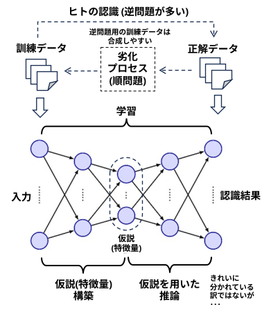

<html lang="ja">
<head>
<meta charset="utf-8" />
</head>
<body>
<h1>
アルゴリズムとコード
</h1>
<h2>なにものか？</h2>

　"<strong>私たちは「AI以前」を知る最後の世代であり、「AI以後」を形作る最初の世代でもある。</strong>" 
　『ヒトとAI』　岡野原大輔

AI(機械学習)の時代では、大量の訓練データを使って、名もない仮説(事前情報、特徴量) を大量に作り出して問題を解いてしまうが、 
(しかも逆問題の学習データは機械的に合成しやすい)

AI以前の時代には、研究者が手作りの仮説、アルゴリズムを提案して問題を解いていた。 
・gauss フィルター, laplaceフィルタ、Sobelフィルタ、Prewitt フィルタ、･･･ 
・Harris, SIFT, SURF, FAST, BRISK, ORB、AKAZE･･･  
・haar-like 特徴、HOG、LBP、･･･ 
 
そんな仮説、アルゴリズムとお試しコードを集めてみようかと思う。

<h2>0～9</h2>
<h2>A</h2>
<h2>B</h2>

・<a href="https://boyoyon.github.io/Algorithms_and_Codes/data/bresenham/bresenham.html">Bresenham’s Algorithm</a> 

<h2>C</h2>
<h2>D</h2>

・<a href="https://boyoyon.github.io/Algorithms_and_Codes/data/dark_channel_prior/dark_channel_prior.html">Dark Channel Prior</a> 

<h2>E</h2>
<h2>F</h2>
<h2>G</h2>
<h2>H</h2>
<h2>I</h2>
<h2>J</h2>
<h2>K</h2>
<h2>L</h2>
<h2>M</h2>

・<a href="https://boyoyon.github.io/Algorithms_and_Codes/data/mds/mds.html">MDS: Multi Dimensional Scaling (多次元尺度構成法)</a> 

<h2>N</h2>
<h2>O</h2>
<h2>P</h2>
<h2>Q</h2>
<h2>R</h2>
<h2>S</h2>
<h2>T</h2>
<h2>U</h2>
<h2>V</h2>
<h2>W</h2>
<h2>X</h2>
<h2>Y</h2>
<h2>Z</h2>
    </body>
</html>